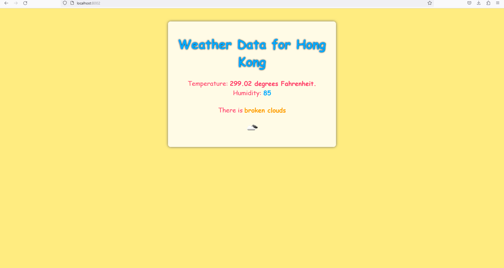

# Lab-2

In this lab you will build a weather app using Node.js and API calls.

1. Install node.js ([https://nodejs.org/en/download/](https://nodejs.org/en/download/): select LTS), if you don't have it already.
2. Create the project folder.

```bash
mkdir weatherApp
cd weatherApp
```

3. Create necessary files.

```bash
atom index.html weatherapp.js style.css
```

4. Initialize the package manager.

```bash
npm init
```

5. Install express package using npm.
6. Get your API keys at [https://rapidapi.com/signup](https://rapidapi.com/signup) for Open Weather Map API.
7. Edit the weatherapp.js file as needed. 
    1. Test your code for full functionality.
    2. For example: What happens if they enter nothing for the city name? How can you fix inside the code is it is empty? 
    If the application is experiencing a crash, include a straightforward conditional statement to verify that the 'city' variable contains a value before initiating the API call. In the event that 'city' is empty, respond to the client with an error message.
8. Display on your page at least **three** weather-related information in a nice way. Get creative with your design. You can add icons or use API icons if there are any.
9. Last but not the least, **deploy and run** you app on **Heroku**.
    1. Submit your heroku link in the github repository read.me file.
10. Update the **readme file** by answering the following questions:
    1. Assume that in your API call you received a 401 status code. Which part of your code most probably is not correct? the APi hostname or key
    2. Explain your design choices and how you used CSS to realize those changes.
     used brighter colors and a playful font to give the page a more vibrant and fun look
11. Submit your repository via github.


link: https://kadipi-app.onrender.com/

home screen


Weather screen


